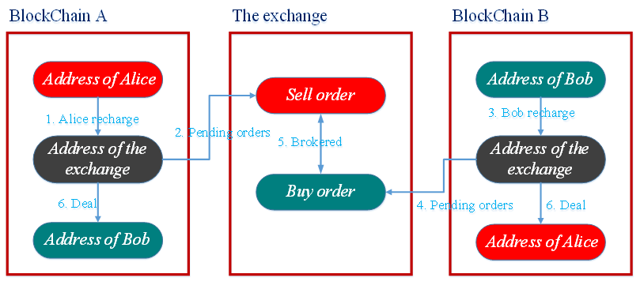

# zk-Relayers: Enabling Cross-chain Communication

## 1. Introduction

In 2024, blockchain technology is rapidly evolving and transforming, with cross-chain technology gaining increasing market favor. Numerous independent blockchain networks have emerged, each with its unique features and advantages. Some of the leading chains are listed in the table below:

<table border="2" align="center">
	<tr>
		<th align="center" width="10%">Name</th>
		<th align="center" width="20%">Features</th>
        <th align="center" width="35%">Advantages</th>
        <th align="center" width="35%">Disadvantages</th>
        </th>
	</tr>
		<tr>
		<th align="center" width="10%">Bitcoin</th>
		<th align="center" width="20%">Decentralized, secure, immutable, based on Proof of Work (PoW) consensus mechanism.</th>
        <th align="center" width="35%">High Security: The PoW mechanism ensures the security of the Bitcoin network and its strong resistance to attacks.   Decentralization: No single institution controls the network, avoiding centralized risks.   Globality: Bitcoin is a globally recognized digital currency, not limited by geography.
        </th>
        <th align="center" width="35%">Slow Transaction Speed: Bitcoin transaction confirmation times are long, with limited transactions per second.   High Energy Consumption: The PoW mechanism requires a lot of energy, which has a negative impact on the environment.   Poor Scalability: The Bitcoin network is difficult to scale and handle large numbers of transactions.</th>
        </th>
        <tr>
		<th align="center" width="10%">Ethereum</th>
		<th align="center" width="20%">Smart contract platform, supports decentralized application (DApps) development, based on PoW consensus mechanism (upgraded to PoS in 2022).
        </th>
        <th align="center" width="35%">Programmability: Supports smart contracts, enabling a variety of complex application scenarios.   Active Community: Ethereum has a large developer community that is constantly developing new applications and tools.   Rich Ecosystem: Ethereum has a large number of DeFi applications, NFT projects, etc., forming a rich ecosystem.   Decentralization: No single institution controls the network, avoiding centralized risks.</th>
        <th align="center" width="35%">High Transaction Fees: Ethereum network congestion leads to high transaction fees.   Poor Scalability: The Ethereum network is difficult to scale and handle large numbers of transactions.   Security Issues: Smart contracts are at risk of security vulnerabilities.</th>
        </th>
        <tr>
		<th align="center" width="10%">Solana</th>
		<th align="center" width="20%">High-performance blockchain, supports thousands of transactions per second, based on Proof of History (PoH) consensus mechanism.</th>
        <th align="center" width="35%">High Throughput: Solana has fast transaction speeds and can process thousands of transactions per second.   Low Transaction Fees: Solana's transaction fees are low, attracting a large number of users.   Developer Friendly: Solana provides friendly development tools, making it easy for developers to build DApps.</th>
        <th align="center" width="35%">High Degree of Centralization: Solana has a small number of validator nodes, posing a risk of centralization.   Incomplete Ecosystem: Solana's ecosystem is still developing and is relatively weak compared to Ethereum.   Network Stability: The Solana network has experienced multiple outages, and its stability needs to be improved.</th>
        </th>
        <tr>
		<th align="center" width="10%">Polkadot</th>
		<th align="center" width="20%">Cross-chain platform, designed to connect different blockchain networks, based on Proof of Stake (PoS) consensus mechanism.</th>
        <th align="center" width="35%">Cross-chain Interoperability: Polkadot can connect different blockchain networks to achieve cross-chain communication and asset transfer.   High Scalability: Polkadot supports sharding technology, which can improve network throughput.   Customizable: Polkadot allows developers to create custom blockchain networks to meet the needs of different application scenarios.</th>
        <th align="center" width="35%">Technical Complexity: Polkadot's technical architecture is complex, posing some challenges for developers.   Slow Ecosystem Development: Polkadot's ecosystem is still developing and is relatively weak compared to Ethereum.   Security Issues: The security of the Polkadot network needs to be further verified.</th>
        <tr>
		<th align="center" width="10%"> Cosmos</th>
		<th align="center" width="20%">Cross-chain platform, designed to connect different blockchain networks, based on PoS consensus mechanism.</th>
        <th align="center" width="35%">Cross-chain Interoperability: Cosmos can connect different blockchain networks to achieve cross-chain communication and asset transfer.   Flexible Architecture: Cosmos supports a variety of different blockchain networks and has a flexible architecture.   Active Community: Cosmos has an active developer community that is constantly developing new applications and tools.</th>
        <th align="center" width="35%">Security: The security of the Cosmos network needs to be further verified.   Scalability: The throughput of the Cosmos network is limited.   Slow Ecosystem Development: The Cosmos ecosystem is still developing and is relatively weak compared to Ethereum.</th>
        </th>
</table>

The proliferation of independent blockchain networks has resulted in fragmentation, leading to insufficient data and asset liquidity, hindering the further development of the blockchain ecosystem. Therefore, cross-chain technology has emerged to break down the barriers between blockchains, enabling interoperability and building a more open and interconnected digital world.

## 2. Cross-Chain Technology

The development of cross-chain technology can be broadly categorized into three stages: **the single-chain expansion stage**, **the relay cross-chain stage**, and **the interoperability stage**.

The single-chain expansion stage focuses on cross-chain transactions of crypto assets, utilizing technologies such as notarization, hash locking, and sidechains.

The relay cross-chain stage provides reusable data structures and a framework for network, consensus, incentives, and smart contracts to create customizable blockchains that can communicate with each other. Prominent frameworks include Cosmos and Polkadot.

The interoperability stage represents a deepening of the relay cross-chain stage. It provides an abstraction layer with a unified set of operational interfaces, allowing DApps to interact with different chains using a single, standardized API. Early technologies included Trusted Relays, Blockchain-Agnostic Protocols, and Blockchain Migrators, while current approaches are primarily represented by cross-chain bridges.

From the perspective of cross-chain technology development, earlier technologies focused more on asset transfer, while current projects increasingly emphasize the transfer of chain state.

### 2.1 Cross-Chain Classification

Cross-chain interactions can be classified into homogeneous cross-chain and heterogeneous cross-chain, depending on the underlying blockchain platform. Homogeneous cross-chain refers to interactions between blockchains that share the same security mechanisms, consensus algorithms, network topology, and block generation and verification logic. Cross-chain interaction between these is relatively simple. Heterogeneous cross-chain interactions, however, are more complex. For example, Bitcoin uses a PoW algorithm, while a permissioned blockchain like Fabric uses a traditional deterministic consensus algorithm. Their block structures and mechanisms for ensuring determinism differ significantly, making direct cross-chain interaction difficult to design. Cross-chain interaction between heterogeneous blockchains typically requires the assistance of a third-party service.

### 2.2 Several Cross-Chain Technologies

#### 2.2.1 Notary Technology

Notarization technology is the simplest method for cross-chain transactions of crypto assets. For example, Alice sends asset A to the notary's address and places a sell order on the notary's server. Bob then sends asset B to the notary's address and places a buy order. After the notary facilitates the trade, asset A is sent to Bob's address, and asset B is sent to Alice's address. The drawback of the notary mechanism is the inherent centralization risk.

Figure 1 Notary Mechanism

#### 2.2.2 Hash locking technology

Hash locking technology involves the locking of assets on their respective chains using a hash lock. A time lock mechanism prevents the retrieval of assets before the preimage of the hash lock is revealed. Hash time locking is not limited to public chains; it can also be integrated into permissioned blockchains. However, hash time locking has limitations, such as potentially leading to unfair trades. For example, the party locking later or unlocking first can decide whether to proceed based on the price of the crypto asset.

Figure 2 Hash locking technology

#### 2.2.3  Sidechains

Sidechain technology enables the verification and parsing of block and transaction data from the main chain. The core technology behind sidechain implementation is a two-way peg, which allows for the locking of digital assets on the main chain while simultaneously releasing equivalent assets on the sidechain. The reverse is also true: when assets are locked on the sidechain, the equivalent pegged assets on the main chain can be released. This process typically involves the following steps:

* (1) Sending a locking transaction: Locking Bitcoin on the main chain. The Bitcoin holder initiates a special transaction to lock the Bitcoin on the blockchain.

* (2) Waiting for a confirmation period: This period allows sufficient confirmations of the locking transaction to prevent fraudulent locking transactions and denial-of-service attacks.

* (3) Redeeming on the sidechain: After the Bitcoin confirmation period, the user creates a transaction on the sidechain to spend the output of the locked transaction, providing a Simplified Payment Verification (SPV) proof-of-work. The output is sent to the user's sidechain address. This transaction is called a redemption transaction, and the SPV proof-of-work refers to the proof-of-work of the block containing the redemption transaction.

* (4) Waiting for a contention period: This period prevents double-spending. During this time: (a) the redemption transaction is not included in a block; (b) newly transferred Bitcoin cannot be used; (c) if a proof-of-work with greater difficulty appears (i.e., the redemption transaction includes an SPV proof from the Bitcoin main chain with higher difficulty), the previous redemption transaction will be replaced. After the contention period, the redemption transaction is included in a block, and the user can use their Bitcoin.

A sidechain is a type of blockchain anchored to a token on a parent chain (main chain). For example, Ethereum could be a sidechain for Bitcoin, with Bitcoin serving as the main chain. However, the main chain is unaware of the sidechain's existence, while the sidechain is aware of the main chain – meaning the sidechain can read the main chain. A drawback of sidechains is that, as transaction volume increases, the internal data storage of smart contracts can swell, potentially slowing transaction processing speeds or even causing congestion.

Sidechains establish a connection with the main chain through a specific two-way peg mechanism, enabling token flow between the main chain and the sidechain. Sidechains can address scalability and functionality issues on the main chain, improving the blockchain's flexibility and scalability. Through sidechains, complex functionalities such as decentralized finance (DeFi) applications and cross-chain interoperability can be achieved.

#### 2.2.4 Relay Chains

Relay chains provide a reusable framework of data structures, networking, consensus mechanisms, incentives, and smart contract technologies for creating customizable blockchains that can communicate with each other. 

Current major frameworks include Cosmos, Polkadot, and Ethereum's Beacon Chain. Cosmos is a multi-chain parallel blockchain network where each chain is called a Zone. All Zones use the same consensus algorithm (Tendermint). Zones can transfer information to other Zones through a Hub, which minimizes the number of connections between Zones and prevents double-spending attacks. For example, Zone A can transfer its digital assets to Zone B or receive assets from Zone B. In this process, Zone A only needs to trust the Hub and Zone B. This design also simplifies blockchain development. For example, Cosmos abstracts blockchain development into three layers: network, consensus, and application. Tendermint implements the network and consensus layers, then connects to the application layer through an internal Application Blockchain Interface (ABCI) protocol. Cosmos also provides an SDK for developers to build applications at the application layer.

Relay chain development is still in its early stages, but its potential is enormous, and it is poised to become a significant direction in the blockchain field.

## 3. Interoperability Stage: Cross-Chain Bridges

With the further development of the multi-chain ecosystem in the current blockchain industry, many assets exist on different chains, as do many DApps. Different DApps are built on different public chains and cannot interact smoothly, and on-chain assets cannot be quickly migrated or exchanged. Therefore, the third stage of cross-chain technology (the interoperability stage) has emerged, with cross-chain bridges as a typical example. Cross-chain bridges are infrastructure protocols connecting independent blockchain networks, allowing seamless transfer of digital assets between blockchains to enhance interoperability.

### 3.1 Forms of Interoperability

While cross-chain transfers appear to involve asset movement, they are essentially just "message" transfers between chains. These messages are like instructions such as "lock/burn assets on chain A" or "unlock/mint assets on chain B." The recipient of the message executes the corresponding action based on the message content.

Since cross-chain transfers are actually information interactions, there can be different implementation methods. For example, the following two diagrams illustrate "A cross-chain form of independent interconnection" and "Cross-chain form of using connectors."

Figure 3 Cross-chain form of independent interconnection

Figure 4 Cross-chain form of using connectors

Both methods described above have their own advantages and disadvantages. Our focus is on the fact that, during the interoperability process, "chains are unaware of each other's existence," meaning it requires "trusting someone to relay the message." Therefore, the main technical challenge lies in verifying the validity of a received message.

### 3.2 Cross-chain bridges

Cross-chain bridges are a crucial pathway for connecting isolated blockchains and enabling interoperability. Cross-chain bridging typically involves locking or burning crypto assets on the original chain using smart contracts, and then unlocking or minting equivalent assets on the new chain.

Several major types of cross-chain bridges include Trusted Relayers, Optimistic Verification, and Light clients.

#### 3.2.1 Trusted Relayers

Trusted Relayer technology is essentially just a trusting message relayer. Once a message relayer is trusted, there's no need to further verify the message's validity; any message from a trusted relayer is accepted as valid. Naturally, with this trust and centralization assumption, the architecture becomes much simpler and the cost lower.

The security assumption of Trusted Relayers is an Honest Majority – that is, more than half of the message relayers must be honest and trustworthy. If more than half of the relayers are malicious or compromised by hackers, the cross-chain bridge becomes insecure.

#### 3.2.2 Optimistic Verification

This technology adopts an optimistic approach, initially accepting transmitted messages without immediate verification. However, it incorporates a validation mechanism. If a message is deemed invalid, a challenge is initiated. The advantage is that the system operates normally in the vast majority of cases (since malicious actions are challenged and penalized), messages are valid and thus challenges are rarely needed, resulting in very low costs as on-chain message verification is unnecessary. The drawback is the requirement of a challenge period (Optimistic Window) to allow validators sufficient time to verify and initiate challenges.

A typical Optimistic Verification system involves three roles: Updater, Relayer, and Watcher.

***Updater***: Stakes collateral and acts as a guarantor for message signatures.

***Relayer***: Transmits messages and the Updater's signature to the target chain.

***Watcher***: Monitors the Updater and responds to malicious actions.

#### 3.2.3 Light client

This method establishes the destination chain as a light client of the source chain. This can be implemented either by running a light client off-chain or by simulating a light client on-chain using a smart contract. The contract records each block from the source chain and verifies its block header. Beyond verifying the validity of the header's contents, it also verifies the consensus mechanism – performing Proof-of-Work (PoW) calculations or validating Proof-of-Stake (PoS) voting results.

Due to variations in block content and consensus mechanisms across different chains, the verification cost of a light client is significantly higher than other cross-chain bridges. However, its advantage lies in its enhanced security: it doesn't rely on the Relayer's trustworthiness, as it independently verifies both the blocks and the consensus.

#### 3.2.4 Cost and Security

Of the three cross-chain bridge technologies described above, Trusted Relayers offer the lowest cost because they require minimal complex verification. However, this comes at the expense of the lowest security, as they rely entirely on the trustworthiness of the Relayer.

Optimistic Verification requires verification of Merkle Proofs and assumes at least one honest Watcher. It offers a moderate level of both cost and security.

Light Clients require the most extensive verification, including consensus, block headers, and proofs of transactions or state. This results in higher costs but significantly improved security.

## 4. zk-Relayer

Existing cross-chain bridge technologies all involve a crucial role: the Relayer. Its function is to transmit messages and data to the destination chain, completing the message delivery process. In Trusted Relayers, the Relayer is assumed to be trustworthy, eliminating the need to verify the validity of the information it provides. Other cross-chain bridge technologies typically employ varying levels of verification of the Relayer's transmitted information to ensure security.

### 4.1 Relayer Operation Principles

The analysis above reveals that a trustworthy Relayer is crucial for enabling cross-chain communication. We seek a method to guarantee the security of cross-chain information at minimal cost. This method is Zero-Knowledge Proof (zk-proof).

Zero-Knowledge Proof is a cryptographic technique allowing one party (the prover) to convince another party (the verifier) that a statement is true without revealing any information beyond the statement's truthfulness. For example, in ZK-Rollups (a type of Rollup implementation), zero-knowledge proofs verify the validity of off-chain transactions while preserving transaction data privacy.

The Relayer utilizes zero-knowledge proof technology to generate a concise proof for each batch of transactions. This proof is submitted to a smart contract on the chain for verification. The smart contract only needs to verify the proof's validity, without examining the details of each transaction, significantly improving cross-chain execution efficiency while maintaining very high security.

### 4.2 Analysis of zk-Relayer Technology

Let's examine a zk-Relayer example: zk-Rollup. zk-Rollup projects are Layer 2 scaling solutions, typically involving two fundamental roles:

* Transactor: This can be considered the user. The user constructs a transaction, signs it with their private key, and sends it to the Relayer.

* Relayer: This entity collects and validates user transactions, batches and compresses them, and generates a zk-SNARK proof. Finally, the Relayer submits the core data from user transactions, the proof, and the Merkle root of the updated user state to the Layer 2 smart contract on the chain. After the Layer 2 smart contract verifies the proof, it updates the Merkle root of the new state to the stateRoot of the new block. Therefore, it can also be called a zk-Relayer.

In essence, zk-Rollup offloads user state changes from the main chain to off-chain processing, using zk-SNARK proofs to ensure the correctness of the off-chain state transitions and their results.

The diagram below illustrates the zk-Relayer's execution process.

Figure 5 zk-Relayer

The input and output of a zk-Relayer's execution process are:

* Input: Several transactions signed with the Transactor's private key, and the Merkle Tree Root of a specific block on the blockchain.

* Output: A zk-proof and the Merkle Tree Roots before and after the transactions: r1 and r2.

The generated zk-proof guarantees:

* The state transition process before and after the transactions is valid; that is, the submitted Merkle Tree Roots r1 and r2 are correct.

* The data in each transaction is valid.

* The user's signatures are valid.

* The on-chain smart contract verifies the validity of this batch of transactions by simply checking if the original state root matches the submitted r1 and by verifying the submitted zk-proof.
  
### 4.3 Cross-Chain with zk-Relayers

The previous section's zk-Rollup example analyzed the operational principles of the zk-Relayer. Initially used for Ethereum scaling, the zk-Relayer's technical characteristics now offer unparalleled advantages in building trustless, fully interoperable protocols. A prime example is LayerZero, a blockchain interoperability solution, essentially an on-chain light client developed by LayerZero Labs, designed to break down information silos between different blockchains, enabling the seamless flow of value and data. While the previously mentioned Light Client cross-chain bridges are secure, they are expensive. Therefore, using a zk-Relayer can significantly reduce this cost.

LayerZero uses the cross-chain structure shown in Fig. 4. It deploys a set of smart contracts on each supported network (Ethereum, Solana, Polygon, etc.), requiring users to interact with LayerZero contracts and the respective chain's contracts.

At its core is a "neutral message-passing layer" (primarily employing zk-Relayer technology). This enables direct, trustless interaction between different blockchain systems without relying on centralized third parties or bridges. This design reduces the attack surface and enhances the security of cross-chain asset transfers.

Figure 5 LayerZero

LayerZero refers to their light clients on various chains as "LayerZero Endpoints," which consist of smart contracts.

LayerZero relies on Oracles and Relayers to transfer messages between these on-chain endpoints. Oracles are responsible for fetching block headers, while Relayers retrieve transaction event information.

Oracles can function as third-party services, providing a mechanism independent of other LayerZero components. They read a block header from one chain and send it to another, enabling verification of the source chain transaction's validity on the destination chain.

Relayers are off-chain services that don't fetch block headers but retrieve specific transaction information and submit proofs.

The block headers submitted by the Oracle are cross-validated with the transaction proofs submitted by the Relayer. These two components don't form a consensus but simply transfer messages; cross-chain communication is achieved through simple verification.

### 4.3 Key Advantages of zk-Relayers

* Privacy Protection: zk-Relayers utilize Zero-Knowledge Proofs to protect transaction information, preventing the disclosure of transaction details.

* Security: Zero-Knowledge Proofs ensure the legitimacy of transactions, preventing malicious attacks and fraudulent activities.

* Scalability: zk-Relayers can handle a large volume of cross-chain transactions, increasing cross-chain efficiency.

## 5 Future Prospects

If consensus mechanisms are the soul of blockchain technology, then for blockchains, especially consortium and private chains, cross-chain technology is the key to realizing a value network. It's the cure that rescues consortium chains from being isolated islands, serving as the bridge for blockchain expansion and interconnection.

The Relayer approach is poised to be a dominant form of future cross-chain network architecture. Whether it's a relay chain or a relay platform, it can function as a trusted message verification platform, alleviating the information verification burden on blockchain platforms. With the advancement of ZKP technology, zk-Relayers will become a crucial component of cross-chain technology. They protect transaction information via ZKPs, enabling privacy-preserving cross-chain interactions. In the future, zk-Relayers may support a wider range of blockchain networks, achieving broader cross-chain interoperability and contributing to the creation of a more secure, efficient, and privacy-preserving cross-chain ecosystem.

## References：

[1]Dinh, T. T. A., Wang, H., Chen, S., Vo, B., Nguyen, Z. T., & Thai, M. T.. Blockchain Interoperability: A Comprehensive Survey. IEEE Access, 9, 38904-38940. 2021.https://doi.org/10.1109/ACCESS.2021.3063461

[2]Shahsavari, S., Ravi, A., Sharif, K., Moniruzzaman, M., & Singhal, M.. A Survey on Cross-Chain Interoperability Solutions.2021. arXiv preprint arXiv:2106.09491.

[3]Buchman, E., Kwon, J., & Jae Kwon, Z.. Cosmos: A Network of Distributed Ledgers.2017. https://cosmos.network/cosmos-hub-whitepaper.pdf

[4]Buterin, V..Cross-Chain DeFi: Bridging the Gap Between Blockchains. Vitalik.ca.2021. https://vitalik.ca/general/2021/01/26/crosschain.html

[5]StarkWare. StarkNet: A permissionless decentralized ZK-Rollup. 2023. https://docs.starknet.io/

[6]https://docs.layerzero.network/v2/home/getting-started/send-message

[7]https://arxiv.org/pdf/2210.00264
